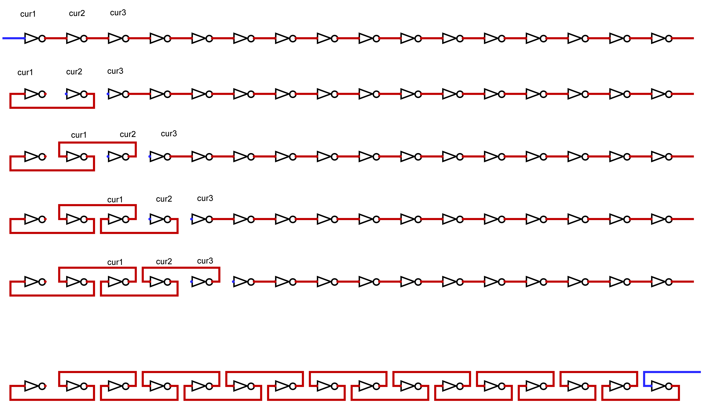

# 92. 反转链表 II

难度：<font color=orange>**中等**</font>

## 题目

给你单链表的头节点 `head` 和两个整数 `left` 和 `right` ，其中 `left <= right` 。请你反转从位置 `left` 到位置 `right` 的链表节点，返回 **反转后的链表** 。


**示例 1：**

```
输入：head = [1,2,3,4,5], left = 2, right = 4
输出：[1,4,3,2,5]
```

**示例 2：**

```
输入：head = [5], left = 1, right = 1
输出：[5]
```

**提示：**

* 链表中节点数目为 `n`
* `1 <= n <= 500`
* `-500 <= Node.val <= 500`
* `1 <= left <= right <= n`

## 题解

先考虑反转整个链表的情况，可以使用三指针法在$\mathcal O(N)$的时间内使用$\mathcal O(1)$的空间反转链表

链表反转的三指针法：定义`cur1, cur2, cur3`三个指针，分别指向链表的头节点、第二个节点与第三个节点。指针`cur1, cur2`用于交换链表节点的连接方向。由于交换节点操作破坏了原有的连接结构，因此需要一个额外的指针`cur3`用于移动指针。

三指针法的主要流程如下图：

1. 初始化`cur1, cur2, cur3`，置`cur1->next`为`NULL`
2. 令`cur2->next = cur1`，完成交换操作
3. 令`cur1 = cur2`
4. 令`cur2 = cur3`
5. 如果`cur3`不为`NULL`，`cur3`在链表上向前移动，然后返回2
6. 如果`cur3`为`NULL`，结束
7. 返回`cur2`



反转给定范围内的链表，需要注意如下情况：

* 如果反转区间从第一个节点开始，链表的头节点会改变，否则不改变
* 如果区间长度为1，则无需反转
* 反转后需要更新反转区间前后的节点连接关系

整体代码如下：

```c
/**
 * Definition for singly-linked list.
 * struct ListNode {
 *     int val;
 *     struct ListNode *next;
 * };
 */
struct ListNode* reverseBetween(struct ListNode* head, int left, int right){
    if (left == right)
        return head;
    struct ListNode *cur = head, *prev = NULL;
    left--;
    right--;
    while (left)
    {
        left--;
        right--;
        prev = cur;
        cur = cur->next;
    }
    struct ListNode * cur2 = cur->next, *cur3 = cur2->next, *tail = cur;
    while (right)
    {
        cur2->next = cur;
        cur = cur2;
        cur2 = cur3;
        if (cur3)
            cur3 = cur3->next;
        else
            break;
        right--;
    }
    tail->next = cur2;
    if (prev)
        prev->next = cur;
    return prev ? head : cur;
}
```

[Reference](https://leetcode-cn.com/problems/reverse-linked-list-ii)