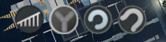
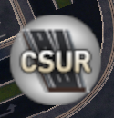

# 都市天际线·模组清单及介绍

## 开始之前

开始之前，应当谨记如下注意事项：

1. 不要使用“退回到主菜单”功能返回主界面重新加载存档，会导致模组二次加载从而造成冲突。

    > As a general rule, ALWAYS quit to the desktop between loads and NEVER to the main menu! This is a Unity game, which means you can’t do a second load if you mod the game.
    >  
    > A second-load is loading another map/save when one has been already been loaded before in the current session, including after quitting to the main menu. The game loads mods in two halves, one part on the Paradox logo, and one part during the loading screen. By loading a second time, the game forces mods to load themselves twice, which causes problems.
    >  
    > -- By *LemonsterOG*

2. 在订阅模组之前，应当仔细检查模组的相关说明和评论区，避免因模组冲突导致包括但不限于存档破坏、游戏卡顿、未响应甚至崩溃的各种异常。
3. 在取消模组订阅之前，应先查阅模组的说明，判断模组是否对存档造成了影响，取消模组订阅是否会导致存档破坏。部分模组提供了恢复模式用来将存档恢复到订阅前的状态，请按照模组说明执行。不要在游戏运行中取消**任何**资产或模组的订阅。
4. 如果在模组使用中出现异常，需要向开发者进行反馈，请务必**尽可能**提供充足的信息，让开发者能够快速、准确地定位问题。这些内容包括但不限于：

    * [Mod Compatibility Checker](https://steamcommunity.com/sharedfiles/filedetails/?id=2034713132)模组产生的兼容性检查报告
    * 导致游戏错误的上一步行为（你做了什么导致游戏出问题）
    * 游戏内的错误提示或异常行为（游戏出了什么问题）
    * 游戏对话框中的错误信息（如果有）
    * 游戏的调试信息显示（游戏内快捷键为F7，如果游戏仍然运行并且可以操作）
    * 游戏崩溃产生的内存记录与日志文件，对于Windows系统，该文件位于`C:\Program Files (x86)\Steam\steamapps\common\Cities_Skylines`文件夹下以“日期_时间”格式命名的文件夹中（如果游戏崩溃）。
    * 游戏产生的其他日志文件，这些文件可能位于`C:\Program Files (x86)\Steam\steamapps\common\Cities_Skylines\Cities_Data`文件夹下。

    有关获取这些信息的更多途径，请参见[Paradox Forum](https://forum.paradoxplaza.com/forum/threads/how-to-best-report-technical-issues-and-get-help.920608)。

5. 不要人身攻击开发者。开发者没有义务长期维持一个模组的更新，并且有权利随时放弃对模组的更新。

    > Please be reminded that mods are created by people in their free time, simply because they love the game or enjoy programming. They don't get paid for this, except for any donations they may get from gamers. Please don't *demand* updates or changes to mods or assets, because *none* of these creators *have* to do anything, including making mods/assets at all. We're lucky to even have the option to use these creations.
    >  
    > -- By *LemonsterOG*

6. 本指南中所使用的图标含义如下：

    * :bootstrap-info-circle:：使用这些模组可能导致轻微的兼容性问题
    * :bootstrap-exclamation-circle:：使用这些模组可能导致较为严重的兼容性问题（如偶尔停止响应、崩溃等），应**尽量避免**同时使用这些模组
    * :bootstrap-x-circle:：使用这些模组可能导致严重的兼容性问题，**不要**同时使用这些模组
    * :bootstrap-question-circle:：表示有待证实的内容

关于模组兼容性和游戏崩溃的更多内容，请参见：

* [Help Us Help You](https://steamcommunity.com/sharedfiles/filedetails/?id=2275436848)
* [Mod Compatibility Checker](https://steamcommunity.com/sharedfiles/filedetails/?id=2034713132)
* [Loading Screen Mod](https://steamcommunity.com/sharedfiles/filedetails/?id=667342976)
* [CSL Crash Mod Debugging](https://steamcommunity.com/sharedfiles/filedetails/?id=628063313)
* [Windows Troubleshooting Guide - Cities Skylines](https://steamcommunity.com/sharedfiles/filedetails/?id=467110757)
* [Mac Troubleshooting Guide - Cities Skylines](https://steamcommunity.com/sharedfiles/filedetails/?id=465738217)
* [Linux Troubleshooting Guide - Cities Skylines](https://steamcommunity.com/sharedfiles/filedetails/?id=467062052)
* [Cities Skylines Troubleshooting FAQ](https://steamcommunity.com/sharedfiles/filedetails/?id=426212120)
* [Log files (output_log.txt or Player.log)](https://steamcommunity.com/sharedfiles/filedetails/?id=463645931)
* [Finding Broken & Bloated Workshop Subscriptions](https://steamcommunity.com/sharedfiles/filedetails/?id=1846793796)

## 道路交通模组

* [Advanced Road Tools](https://steamcommunity.com/sharedfiles/filedetails/?id=1925527132)
* [Advanced Vehicle Options (Sunset Harbor)](https://steamcommunity.com/sharedfiles/filedetails/?id=1548831935)
* [CSUR Loader](https://steamcommunity.com/sharedfiles/filedetails/?id=1959183067)
* [CSUR ToolBox](https://steamcommunity.com/sharedfiles/filedetails/?id=1959342332)
* [Elektrix's Road Tools 2.93](https://steamcommunity.com/sharedfiles/filedetails/?id=1645781000)
* [Fine Road Anarchy 2.0.2](https://steamcommunity.com/sharedfiles/filedetails/?id=1844440354)
* [Fine Road Tool 2.0.4](https://steamcommunity.com/sharedfiles/filedetails/?id=1844442251)
* [Heavy Outside Traffic](https://steamcommunity.com/sharedfiles/filedetails/?id=1596838226)
* [More Vehicles](https://steamcommunity.com/sharedfiles/filedetails/?id=1764208250)
* [Network Extensions 2 (Updated for Sunset Harbor)](https://steamcommunity.com/sharedfiles/filedetails/?id=812125426)
* [Network Multitool 1.2](https://steamcommunity.com/sharedfiles/filedetails/?id=2560782729)
* [Quay Anarchy](https://steamcommunity.com/sharedfiles/filedetails/?id=650436109)
* [Roundabout Builder](https://steamcommunity.com/sharedfiles/filedetails/?id=1625704117)
* [Smart Intersection Builder](https://steamcommunity.com/sharedfiles/filedetails/?id=1677913611)
* [TM:PE V11 STABLE (Traffic Manager: President Edition)](https://steamcommunity.com/sharedfiles/filedetails/?id=1637663252)

### AdvancedRoadTools

|||
|:-:|:-:|
|工坊链接|[1925527132](https://steamcommunity.com/sharedfiles/filedetails/?id=1925527132)|
|依赖项|无|
|游戏内图标||
|不兼容模组|暂无|
|源代码|[https://github.com/pcfantasy/AdvancedRoadTools](https://github.com/pcfantasy/AdvancedRoadTools)|

帮助修建转大圈（90度）的左转匝道与转小圈（270度）的左转匝道。有关该模组的详细教程，请参见[B站视频教程](https://www.bilibili.com/video/BV1UJ411q7fX)

### Advanced Vehicle Options (Sunset Harbor)

|||
|:-:|:-:|
|工坊链接|[1548831935](https://steamcommunity.com/sharedfiles/filedetails/?id=1548831935)|
|依赖项|无|
|游戏内图标||
|不兼容模组|暂无|
|源代码|[https://github.com/CityGecko/CS-AdvancedVehicleOptions](https://github.com/CityGecko/CS-AdvancedVehicleOptions)|

允许自定义车辆的信息，包括但不限于：

* 启用或禁用车辆
* 车辆颜色
* 车辆速度（和加速度）
* （公共交通）车辆容量
* （火车）将最后一列改为车尾

Advanced Vehicle Options（AVO）与Improved Public Transport 2（IPT2）都能修改公共交通数据，在AVO内修改的数据会在IPT2反映出来，不会造成冲突，反之亦然。但AVO无法启用或禁用已经规划线路后的公共交通车辆的生成，需要使用IPT2、Transport Lines Manager 14或游戏内置的公共交通线路（点击“Manage Spawning in Transport Line Overview”按钮）进行调整。

> When setting train routes in Transport Lines Manager 14, assets with AVO "allow this vehicle to spawn" disabled cannot be selected
>  
> -- By *kenty*

货运车辆的容量单位有两种，即卡车数量与车辆携带的资源量。货运飞机、货轮、货运列车的容量以卡车数量为单位，货运卡车的容量以资源量为单位。默认情况下：

* 货运卡车的容量为8000单位，等价于8吨；
* 货运列车的容量为15辆卡车的容量，等价于120吨；货轮的容量为25辆卡车的容量，等价于200吨；货运飞机的容量为20辆卡车的容量，等价于160吨。

> @nhatanh0475 - there is coexistence of ITP2 and AVO. You can change all settings for vehicles in AVO and they are reflected in ITP2 and vice versa. The red colored figures are only a reminder, that whatever you change will reflect in the other mod. There have been users getting confused, eg. on the speed for a specific vehicle, as AVO takes a different factor for the conversion. So if you don't really like IPT2 for configuration, use AVO and it should be all fine.
>  
> -- By *Tim*

请注意，关闭某一种服务的所有车辆会对整个城市产生明显影响。如关闭所有的消防车后，所有的消防站都无法派出车辆扑灭城市中的火灾。

Advanced Vehicle Options默认不支持修改城市服务车辆的容量（服务量），因为修改这些数据可能破坏游戏平衡性，扰乱经济系统。如果确实需要修改相关数据，可以在“选项”/“Advanced Vehicle Options”下找到“Enable various values for non-cargo and non-passenger vehicles”并启用。
该模组**不会**影响游戏存档。禁用或取消订阅**不会**破坏存档。

### CSUR Loader

|||
|:-:|:-:|
|工坊链接|[1959183067](https://steamcommunity.com/sharedfiles/filedetails/?id=1959183067)|
|依赖项|[Ability to Read](https://steamcommunity.com/workshop/filedetails/?id=1145223801)|
|游戏内图标|无|
|不兼容模组|暂无|
|源代码|[https://github.com/citiesskylines-csur/CSURLoader](https://github.com/citiesskylines-csur/CSURLoader)|

CSUR Loader 模组是所有CSUR道路资产的依赖项。CSUR道路本身并不包含材质，材质由CSUR Loader在游戏内进行渲染。使用CSUR道路系统必须**订阅**此模组。

> [SUNSET HARBOR UPDATE] All assets and mods for CSUR are compatible with Sunset Harbor DLC and its free updates.
Core utility mod for the all-new CSUR road system.
This mod is required for any new CSUR road pack on the Workshop:
>  
> [CSUR Reborn](https://steamcommunity.com/sharedfiles/filedetails/?id=1959216109)
>  
> You can distinguish the new CSUR from its predecessors (original CSUR, CSUE) by the “CSUR” logotype and the highway logo similar to the thumbnail of this mod.
>  
> The CSUR Loader provides the following key contents for the CSUR road system:
>  
> * Base textures for CSUR roads: the roads themselves do not contain textures, and CSUR Loader applies a set of “external” textures to CSUR roads after the game is loaded.
> * Sidewalks: CSUR Loader provides dedicated sidewalks designed for CSUR roads.
> * Road props: CSUR Loader provides road props used by CSUR roads, including lights for the elevated mode, custom traffic lights and traffic cameras.
>  
> -- By *VictoriaCity*

### CSUR ToolBox

|||
|:-:|:-:|
|工坊链接|[1959342332](https://steamcommunity.com/sharedfiles/filedetails/?id=1959342332)|
|依赖项|[Harmony 2.0.4-4 (Mod Dependency)](https://steamcommunity.com/workshop/filedetails/?id=2040656402)|
|游戏内图标||
|不兼容模组|:bootstrap-info-circle: [Network Extensions 2 (Updated for Sunset Harbor)](https://steamcommunity.com/sharedfiles/filedetails/?id=812125426)|
|源代码|[https://github.com/citiesskylines-csur/CSURToolBox](https://github.com/citiesskylines-csur/CSURToolBox)|

提供了用于查找CSUR道路的操作面板。可以在选项菜单中调节车道过渡平滑功能、关闭除基本模块外划分分区、TMPE划线功能。

> 1. Provide a UI panel which makes it easy to find CSUR roads
> 2. Make it much easier to select roads with offsets on the map by clicking on road models instead of clicking on their center lines.
> 3. Pillars will be adjusted to the offsets when you are building elevated CSUR roads with offsets.
> 4. Smooth lane shifts
> 5. Disable CSUR Shift Ramp Transition and Express Road Zone
> 6. Call TMPE stayinlane laneconnector for complex CSUR node
>
> -- By *pcfantasy*

请注意，使用第 6 条功能需要安装**TM:PE V11 STABLE**，安装其他版本无效。

关于CSUR Toolbox的详细功能说明，请参见[中文说明书](https://github.com/citiesskylines-csur/CSURToolBox/wiki/%E4%B8%AD%E6%96%87%E8%AF%B4%E6%98%8E%E4%B9%A6)。

### Elektrix's Road Tools 2.93

|||
|:-:|:-:|
|工坊链接|[1645781000](https://steamcommunity.com/sharedfiles/filedetails/?id=1645781000)|
|依赖项|[Ability to Read](https://steamcommunity.com/workshop/filedetails/?id=1145223801)|
|游戏内图标||
|不兼容模组|暂无|
|源代码|暂无|

**别名“特朗普头”**

提供了调整已放置道路的一些功能，包括添加或删除道路节点、创建交叉路口、水平翻转道路材质和平滑道路坡度。点击图标可以打开一个窗口，里面包含了所有可用的工具。

* 添加道路节点：将光标放在一段路段上点击即可
* 删除道路节点：将光标放在需要删除的节点上点击即可。在删除节点后道路的方向、形状可能发生变化，高架桥道路可能会变为地面模式，需要用Move It等模组进行微调
* 创建交叉路口：这个工具用来将相交但不相连的两个路段相连（即创建十字路口），先后选取两个路段后按回车即可
* 水平翻转道路材质：点击需要翻转材质的路段即可（待验证：我也不知道这个功能具体有什么用，可能和不对称道路有关）
* 道路平滑工具：点击需要平滑高度的节点，按回车即可，按Shift+C可以取消选择。*选择的节点必须是连续的，即任意两个选取的节点间不能有没有选择的节点。*

## 公共交通模组

* [Advanced Stop Selection (ex MTSE)](https://steamcommunity.com/sharedfiles/filedetails/?id=1394468624)
* [Airplane Line Tool 1.2](https://steamcommunity.com/sharedfiles/filedetails/?id=639864236)
* [Airport Roads](https://steamcommunity.com/sharedfiles/filedetails/?id=465127441)
* [AutoLineColor Redux](https://steamcommunity.com/sharedfiles/filedetails/?id=1415090282)
* [Improved Public Transport 2](https://steamcommunity.com/sharedfiles/filedetails/?id=928128676)
* [More Network Stuff](https://steamcommunity.com/sharedfiles/filedetails/?id=512314255)
* [Optimised Outside Connections](https://steamcommunity.com/sharedfiles/filedetails/?id=1721492498)
* [Other Rail Track Speed Increaser](https://steamcommunity.com/sharedfiles/filedetails/?id=1586774819)
* [Railway Replacer](https://steamcommunity.com/sharedfiles/filedetails/?id=1530376523)
* [Ship Line Tool 1.1](https://steamcommunity.com/sharedfiles/filedetails/?id=639833119)
* [SingleTrainTrackAI](https://steamcommunity.com/sharedfiles/filedetails/?id=949504539)
* [Stops & Stations](https://steamcommunity.com/sharedfiles/filedetails/?id=1776052533)
* [Transfer Info (beta)](https://steamcommunity.com/sharedfiles/filedetails/?id=1785774902)

## 美化模组

* [Additive Shader](https://steamcommunity.com/sharedfiles/filedetails/?id=1410003347)
* [Building Themes](https://steamcommunity.com/sharedfiles/filedetails/?id=466158459)
* [Clouds & Fog Toggler](https://steamcommunity.com/sharedfiles/filedetails/?id=523824395)
* [Extra Landscaping Tools](https://steamcommunity.com/sharedfiles/filedetails/?id=502750307)
* [Intersection Marking Tool 1.8.2](https://steamcommunity.com/sharedfiles/filedetails/?id=2140418403)
* [Lights On](https://steamcommunity.com/sharedfiles/filedetails/?id=2336182914)
* [Moon Phases](https://steamcommunity.com/sharedfiles/filedetails/?id=751706914)
* [Network Skins (Sunset Harbor compatible)](https://steamcommunity.com/sharedfiles/filedetails/?id=1758376843)
* [No Radioactive Desert And More!](https://steamcommunity.com/sharedfiles/filedetails/?id=666425898)
* [Relight](https://steamcommunity.com/sharedfiles/filedetails/?id=1209581656)
* [Repaint 1.3](https://steamcommunity.com/sharedfiles/filedetails/?id=2101551127)
* [Road Options (Road Colors Changer ++)](https://steamcommunity.com/sharedfiles/filedetails/?id=932192868)
* [Shadow Strength Adjuster](https://steamcommunity.com/sharedfiles/filedetails/?id=762520291)
* [Theme Mixer 2](https://steamcommunity.com/sharedfiles/filedetails/?id=1899640536)
* [Ultimate Eyecandy v1.5.2](https://steamcommunity.com/sharedfiles/filedetails/?id=672248733)
* [Vehicle Effects 1.9.1](https://steamcommunity.com/sharedfiles/filedetails/?id=780720853)

## 资产控制模组

* [Building Themes](https://steamcommunity.com/sharedfiles/filedetails/?id=466158459)
* [Prop & Tree Anarchy](https://steamcommunity.com/sharedfiles/filedetails/?id=593588108)
* [Prop Line Tool  [PLT]  (vAlpha)](https://steamcommunity.com/sharedfiles/filedetails/?id=694512541)
* [Prop Painter 4.0 + PaintUI](https://steamcommunity.com/sharedfiles/filedetails/?id=1869561285)
* [Prop Precision](https://steamcommunity.com/sharedfiles/filedetails/?id=791221322)
* [Prop Snapping](https://steamcommunity.com/sharedfiles/filedetails/?id=787611845)
* [PropRotating Params](https://steamcommunity.com/sharedfiles/filedetails/?id=954067599)
* [Random Tree Brush](https://steamcommunity.com/sharedfiles/filedetails/?id=1654658173)
* [Random Tree Rotation](https://steamcommunity.com/sharedfiles/filedetails/?id=556784825)
* [Repaint 1.3](https://steamcommunity.com/sharedfiles/filedetails/?id=2101551127)

## 资产管理模组

* [AssetsLists - Tired of browsing through all parks and props ? [Snowfall ✓]](https://steamcommunity.com/sharedfiles/filedetails/?id=602844578)
* [Better Road Toolbar](https://steamcommunity.com/sharedfiles/filedetails/?id=2502526929)
* [Find It! 2](https://steamcommunity.com/sharedfiles/filedetails/?id=2133885971)
* [More Advanced Toolbar](https://steamcommunity.com/sharedfiles/filedetails/?id=1597852915)
* [Picker](https://steamcommunity.com/sharedfiles/filedetails/?id=2172488844)

## 真实化模组

* [Difficulty Tuning](https://steamcommunity.com/sharedfiles/filedetails/?id=519781146)
* [Lifecycle Rebalance Revisited 1.5.4](https://steamcommunity.com/sharedfiles/filedetails/?id=2027161563)
* [More Diverse Crowd (a.k.a. Servicemen on Streets)](https://steamcommunity.com/sharedfiles/filedetails/?id=578320825)
* [Real Time](https://steamcommunity.com/sharedfiles/filedetails/?id=1420955187)
* [Realistic Population Revisited 1.4.3](https://steamcommunity.com/sharedfiles/filedetails/?id=2025147082)
* [Vehicle Wealthizer 3](https://steamcommunity.com/sharedfiles/filedetails/?id=1633580257)

## 信息显示模组

* [Building Vehicle Monitor](https://steamcommunity.com/sharedfiles/filedetails/?id=2051693155)
* [CSL Show More Limits](https://steamcommunity.com/sharedfiles/filedetails/?id=531738447)
* [City Web Server](https://steamcommunity.com/sharedfiles/filedetails/?id=411836742)
* [Extended Building Info](https://steamcommunity.com/sharedfiles/filedetails/?id=1875298330)
* [Measure It!](https://steamcommunity.com/sharedfiles/filedetails/?id=1768810491)
* [Precision Engineering](https://steamcommunity.com/sharedfiles/filedetails/?id=445589127)

## 公共服务模组

* [Empty It!](https://steamcommunity.com/sharedfiles/filedetails/?id=1661072176)
* [Extended Building Info](https://steamcommunity.com/sharedfiles/filedetails/?id=1875298330)

## 分区建筑模组

* [Extended Building Info](https://steamcommunity.com/sharedfiles/filedetails/?id=1875298330)
* [Ploppable RICO](https://steamcommunity.com/sharedfiles/filedetails/?id=586012417)

## 工业相关模组

* [Enhanced District Services](https://steamcommunity.com/sharedfiles/filedetails/?id=2303997489)
* [Fish Warehousing](https://steamcommunity.com/sharedfiles/filedetails/?id=2494660480)
* [Supply Chain Coloring](https://steamcommunity.com/sharedfiles/filedetails/?id=2325122732)

## 地形模组

* [Extra Landscaping Tools](https://steamcommunity.com/sharedfiles/filedetails/?id=502750307)
* [Surface Painter](https://steamcommunity.com/sharedfiles/filedetails/?id=689937287)

## 资产模组

* [More Flags ( + flags replacer )](https://steamcommunity.com/sharedfiles/filedetails/?id=595017353)

## 调试模组

* [Duplicate Assembly Scanner (DAS)](https://steamcommunity.com/sharedfiles/filedetails/?id=2013398705)
* [Loading Screen Mod](https://steamcommunity.com/sharedfiles/filedetails/?id=667342976)
* [Mod Compatibility Checker](https://steamcommunity.com/sharedfiles/filedetails/?id=2034713132)
* [Python Console](https://steamcommunity.com/sharedfiles/filedetails/?id=2415465635)

## 依赖项模组

* [Additive Shader](https://steamcommunity.com/sharedfiles/filedetails/?id=1410003347)
* [Custom Animation Loader (CAL)](https://steamcommunity.com/sharedfiles/filedetails/?id=1664509314)
* [Custom Effect Loader](https://steamcommunity.com/sharedfiles/filedetails/?id=1886877404)
* [Extra Vehicle Effects (Plugin for Vehicle Effects Mod)](https://steamcommunity.com/sharedfiles/filedetails/?id=815103125)
* [Extra Train Station Tracks ( ETST )](https://steamcommunity.com/sharedfiles/filedetails/?id=515489008)
* [Harmony 2.0.4-4 (Mod Dependency)](https://steamcommunity.com/sharedfiles/filedetails/?id=2040656402)
* [Network Tiling](https://steamcommunity.com/sharedfiles/filedetails/?id=1274199764)
* [Panel Hook (beta) for modders](https://steamcommunity.com/sharedfiles/filedetails/?id=1769420886)
* [Patch Loader Mod](https://steamcommunity.com/sharedfiles/filedetails/?id=2041457644)
* [Prefab Hook (Mod Dependency)](https://steamcommunity.com/sharedfiles/filedetails/?id=530771650)

## 其他辅助模组

* [CSL Map View](https://steamcommunity.com/sharedfiles/filedetails/?id=845665815)
* [Cinematic Camera Extended](https://steamcommunity.com/sharedfiles/filedetails/?id=785528371)
* [FPS Booster](https://steamcommunity.com/sharedfiles/filedetails/?id=2105755179)
* [First Person Camera: Updated](https://steamcommunity.com/sharedfiles/filedetails/?id=650805785)
* [Move It](https://steamcommunity.com/sharedfiles/filedetails/?id=1619685021)
* [Spawn Points Fix](https://steamcommunity.com/sharedfiles/filedetails/?id=820157360)
* [Touch This! Tool 4](https://steamcommunity.com/sharedfiles/filedetails/?id=1393797695)
* [Transparency LODs Fix](https://steamcommunity.com/sharedfiles/filedetails/?id=922939393)
* [UI Resolution 1.1.2](https://steamcommunity.com/sharedfiles/filedetails/?id=2487213155)
* [Ultimate Level Of Detail (ULOD)](https://steamcommunity.com/sharedfiles/filedetails/?id=1680642819)
* [UnifiedUI (UUI) 2.0 ](https://steamcommunity.com/sharedfiles/filedetails/?id=2255219025)